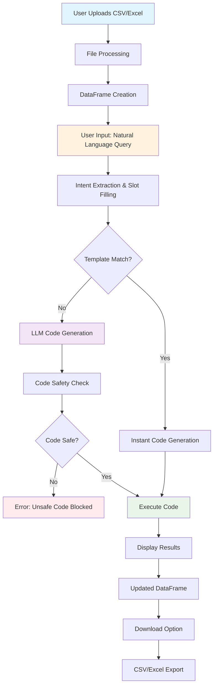

# AI CSV Assistant - Architecture Flowcharts

## Current Architecture

## Proposed Agentic Framework Architecture

i want you to see the current ode struture and suggest e how i can add more features o it ad transformit into a proper web app with agenbtc framewrok with agents and superviser and ui betteer , recomenneation, chyarting style and all

## Multi-Agent Communication Flow

## Enhanced UI Architecture

## Data Processing Pipeline

## Security & Access Control Flow

